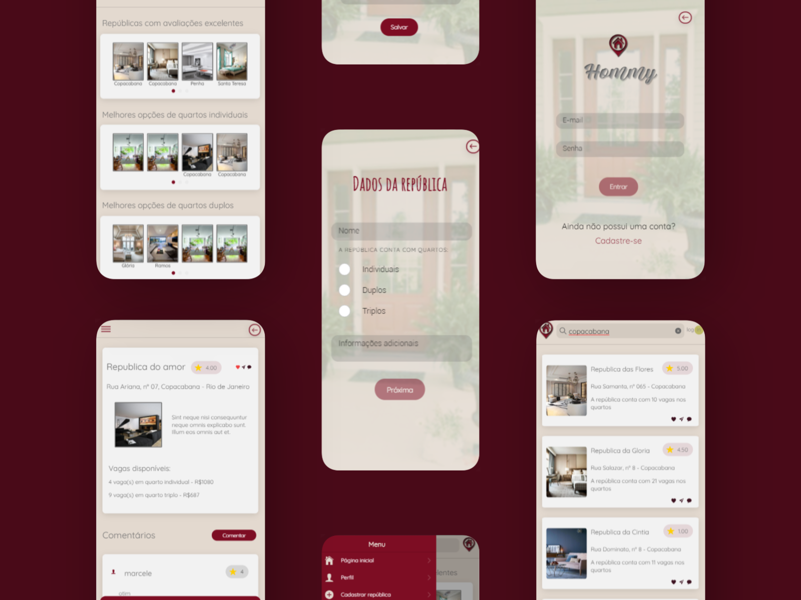

<h3 align="center">
    
    <br>
</h3>

<p align="center"> Projeto Final do treinamento técnico - EJCM. </p>

## O que é o Hommy?
Hommy é um marketplace onde locadores de repúblicas de estudantes podem cadastrar seus estabelecimentos e anunciar suas vagas, possibilitando que os universitários possam encontrar a república ideal para melhorar sua experiência na universidade.

## Tecnologias Utilizadas

O projeto foi desenvolvido utilizando Laravel e Ionic.

## Manual de utilização

### 1. Clonar o projeto em seu computador.

### 2. Instalação

<h4> No arquivo .env, colar as configurações de email: </h4>
        MAIL_DRIVER=smtp
        MAIL_HOST=smtp.gmail.com
        MAIL_PORT=587
        MAIL_USERNAME=aluguelrepublicaoficial@gmail.com
        MAIL_PASSWORD=viwqvvnivqigxgpu
        MAIL_ENCRYPTION=tls
        MAIL_FROM_ADDRESS=aluguelrepublicaoficial@gmail.com
        MAIL_FROM_NAME="${APP_NAME}"

<h4> Na pasta back: </h4>

```bash
composer install
cp .env.example .env
Criar o BD no phpMyAdmin
Mudar o nome do BD  no .env de acordo com o criado anteriormente
php artisan key:generate
php artisan migrate:fresh --seed
php artisan passport:install
php artisan serve
```

<h4> Na pasta front: </h4>

```bash
npm install
ionic serve
```
<h4 align="center">
        <p> Projeto por Gabriele Jandres, Marcele Lami & Milton Quillinan </p>
</h4>
